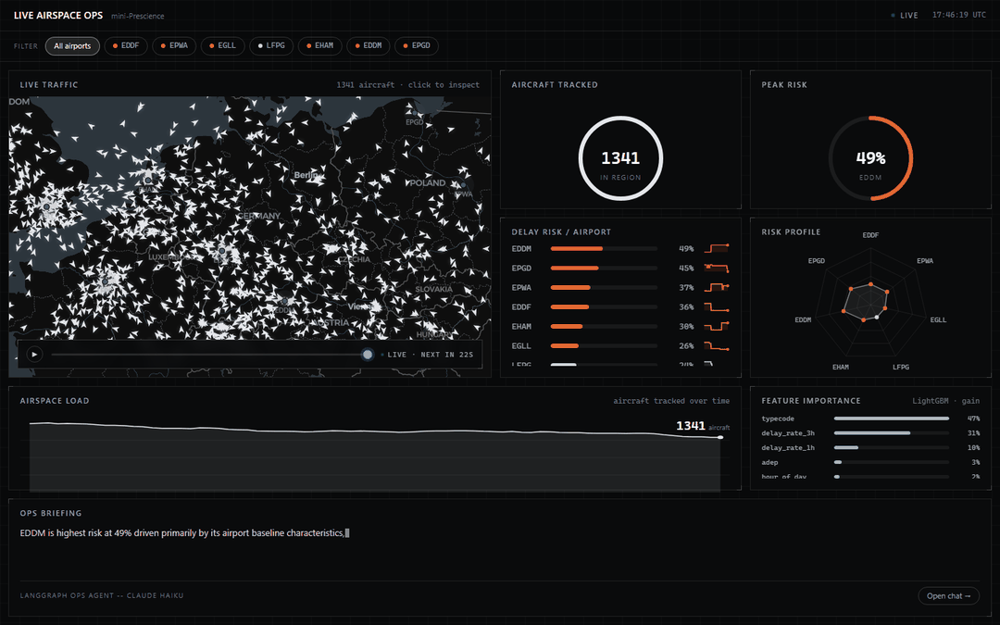
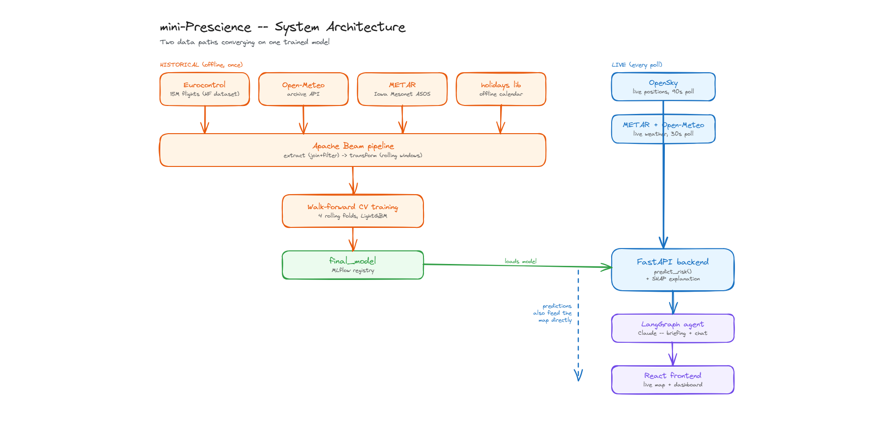
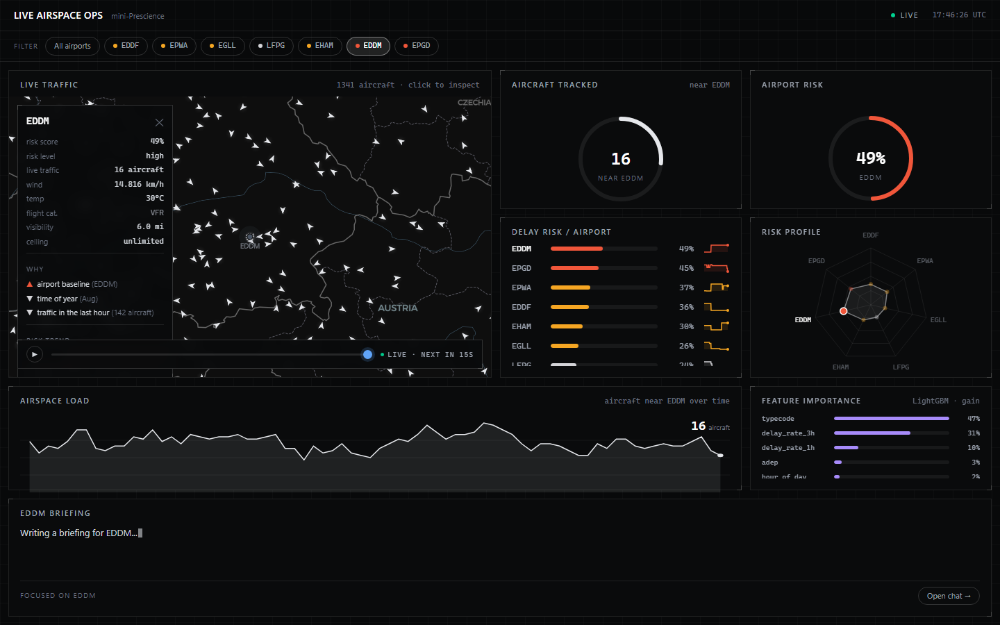
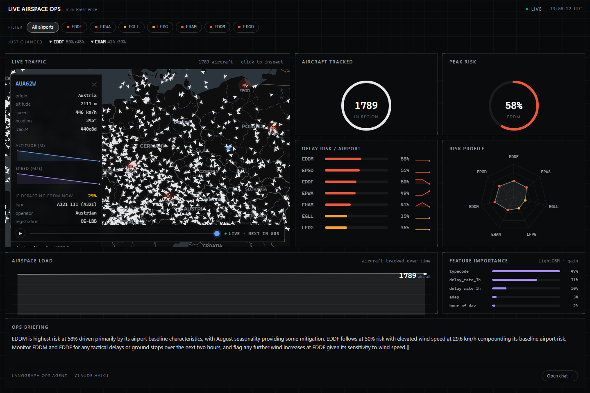
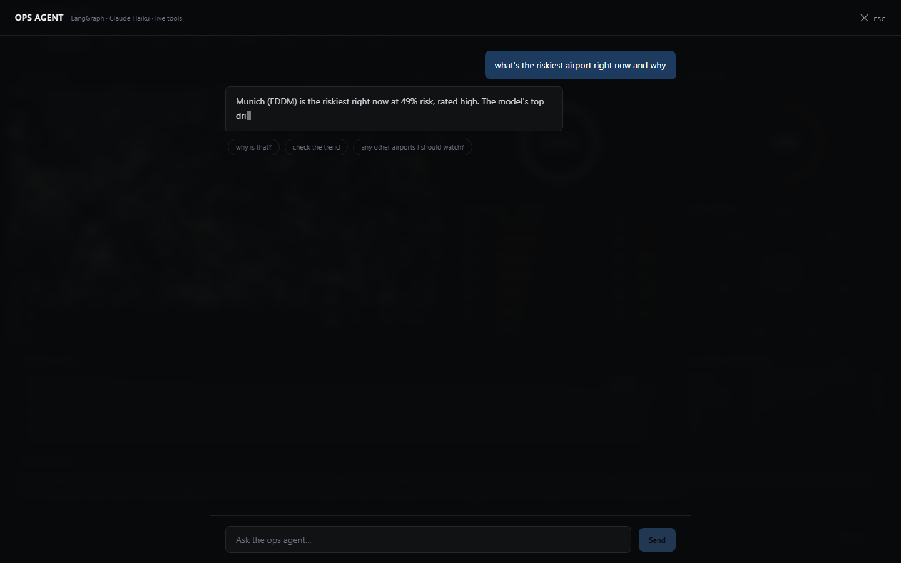

# mini-Prescience — Live Airspace Ops Dashboard

A small, working rebuild of Air Space Intelligence's product idea: predict operational
risk from live aviation data, then explain the prediction in plain language. Built as a
portfolio project for an ML Engineer application to ASI (Gdańsk).



## What this actually is

ASI sells real-time prediction and optimization for critical infrastructure. This
project rebuilds the same shape of problem end to end, at a scale one person can ship:

1. **Ingest** live aircraft positions and airport conditions (OpenSky, METAR, Open-Meteo).
2. **Predict** which airports — or which specific tracked aircraft — are heading for
   delay-causing congestion, from a LightGBM model trained on ~2.3M real historical
   flights.
3. **Explain** the prediction well enough that a non-technical ops person could act on
   it: every risk score comes with the model's own real feature attribution (LightGBM's
   `pred_contrib`, not an LLM guessing a cause), and a LangGraph agent turns that into a
   short ops-desk briefing or answers free-text questions about it.

The bar: someone who's never seen the code should be able to watch a short walkthrough
and believe it's real, not a mockup.

## Quickstart

```bash
git clone <this repo>
cd repo
cp backend/.env.example backend/.env   # add ANTHROPIC_API_KEY at minimum
docker compose up -d --build
```

Then open `http://localhost:5173`. First predictions take ~15-20s (model warm-up +
first live poll). Backend API alone is at `http://localhost:8000`.

**`backend/.env`** needs:
- `ANTHROPIC_API_KEY` — required, powers the LangGraph briefing agent and chat.
- `OPENSKY_CLIENT_ID` / `OPENSKY_CLIENT_SECRET` — optional but recommended. Without
  them OpenSky's anonymous tier (400 credits/day) gets exhausted almost immediately at
  this project's polling rate; a free registered OAuth2 client raises that to 4,000/day.
  Register at [opensky-network.org](https://opensky-network.org).

To retrain the model on a fresh machine (the trained model in `mlruns/` and the
training parquet in `data/` are gitignored, since they're large and reproducible):

```bash
docker compose run --rm --entrypoint python backend scripts/fetch_weather.py
docker compose run --rm --entrypoint python backend scripts/fetch_metar.py
docker compose run --rm --entrypoint python backend scripts/fetch_aircraft_db.py
docker compose run --rm --entrypoint python backend pipeline/beam_features.py
docker compose run --rm --entrypoint python backend ml/train.py
docker compose up -d --build --force-recreate backend
```

(Also needs the raw Eurocontrol flight parquet under `data/raw/eurocontrol_filtered/` —
see `scripts/download_eurocontrol_full.py` / `filter_eurocontrol_*.py`.)

## Architecture

Two data paths converge on one trained model: an **offline pipeline** that turns three
years of historical flights + weather + METAR + holidays into training features via
Apache Beam, and a **live path** that reconstructs the same feature shape in real time
from whatever's actually available right now.

Full diagrams (real, editable `.excalidraw` files — open at
[excalidraw.com](https://excalidraw.com), File → Open):

- [`docs/diagrams/architecture.excalidraw`](docs/diagrams/architecture.excalidraw) — end-to-end system, historical + live paths
- [`docs/diagrams/training-flow.excalidraw`](docs/diagrams/training-flow.excalidraw) — walk-forward CV training run



## Features

**Live map with real physics.** Aircraft advance every frame from their own reported
speed and heading (dead reckoning) instead of easing toward a stale position for the
full 90s between OpenSky polls — a real fix, not a cosmetic one, since 90s is the actual
floor OpenSky's free-tier credit budget allows.

**Per-airport risk, explained.** Click any of the 7 tracked airports for its live risk
score, weather/METAR conditions, and the model's real top 3 feature drivers for *that*
prediction.



**Per-aircraft risk.** Click any tracked aircraft on the map: its real aircraft type is
looked up (OpenSky's public aircraft database, 520k tail numbers) and run through the
same model as a flight-specific prediction — "if this aircraft departed the nearest
tracked airport right now" — instead of the airport-level average.



**A chat agent that actually uses tools.** LangGraph ReAct agent with live tools
(current predictions, aircraft lookup, risk trend) and per-thread memory, so "why is
that risky?" resolves against the real conversation instead of restarting from zero.



**"Just changed" ticker + live countdown.** Real deltas between the last two computed
predictions, and a visible "next update in Xs" instead of the UI silently looking stuck
during OpenSky's 90s poll interval.

## Data sources

| Source | What it's used for | Live or historical |
|---|---|---|
| [OpenSky Network](https://opensky-network.org) | live aircraft positions | live only |
| [Eurocontrol flight delays (HuggingFace)](https://huggingface.co/datasets/345rf4gt56t4r3e3/flight-delays-europe-2023-2025) | training labels, ~2.3M flights after filtering | historical only |
| [Open-Meteo](https://open-meteo.com) | temperature/precipitation/wind (fallback) | both |
| [METAR](https://aviationweather.gov) + [Iowa Mesonet ASOS](https://mesonet.agron.iastate.edu/ASOS/) | visibility/ceiling/flight-category — the *primary* weather source | both |
| [`holidays`](https://pypi.org/project/holidays/) (Python package) | public-holiday calendar per airport's country | both, no network call |
| OpenSky aircraft database | icao24 → real aircraft type/operator, for per-flight predictions | static reference |

METAR became the primary live weather source mid-project after Open-Meteo's free tier
(10,000 calls/day) got exhausted by this project's own testing and stayed rate-limited
for hours — a real production lesson about single points of failure, not a hypothetical
one.

## Model

LightGBM binary classifier predicting `delayed_15min` (actual duration vs. the
historical route+month median, >15 min over). ~5% positive rate.

- **17 features**: calendar (hour/day/month/holiday), general weather, aviation weather
  (METAR-derived visibility/ceiling/flight-category), rolling traffic + delay-rate
  windows, aircraft type.
- **Walk-forward cross-validation**: 4 rolling 3-month folds with an expanding training
  window, not one static split — hyperparameters picked by mean PR-AUC across folds.
  Fold-to-fold PR-AUC varied by ±0.12 around a mean of ~0.28, which a single split
  would never have surfaced.
- **Held-out test** (272,546 rows, touched exactly once): AUC 0.7459, PR-AUC 0.2003,
  F1 0.2528.
- **Explainability**: every prediction ships with LightGBM's native `pred_contrib`
  (real per-row SHAP-style attribution), not a global importance ranking.
- Tracked in **MLflow** — nested hyperparameter-search runs, a `final_model` run the
  backend loads at startup.

Full breakdown with real numbers (fold table, hyperparameter search results, feature
importance): [`docs/diagrams/training-flow.excalidraw`](docs/diagrams/training-flow.excalidraw).

## Stack

| Layer | Technology |
|---|---|
| Data pipeline | **Apache Beam** (DirectRunner) — batch feature engineering over historical flights |
| Model | **LightGBM** — gradient-boosted binary classifier, walk-forward CV via **scikit-learn** + **pandas** |
| Experiment tracking | **MLflow** — nested hyperparameter-search runs, model registry the backend loads from |
| LLM agent | **LangGraph** + **langchain-anthropic** (Claude) — ReAct tool-calling agent for the briefing and chat |
| Backend | **FastAPI** + **uvicorn** — in-memory pollers/caches per data source |
| Frontend | **React** + **TypeScript** + **Vite** + **MapLibre GL** + **Tailwind CSS** |
| Data ingestion | `requests`, `pyarrow`, `datasets` / `huggingface_hub`, `holidays` |
| Notebooks | Jupyter (`ipykernel`, `nbconvert`), `matplotlib` — [`notebooks/model_showcase.ipynb`](notebooks/model_showcase.ipynb) |
| Orchestration | **Docker Compose** — single command, no manual multi-terminal setup |

## Origin

This isn't the first project on this exact topic. An earlier university project built a
classic SQL Server data warehouse + OLAP cube on 5.8M US flight records (2015) — the
same domain, answered descriptively instead of predictively. Write-up, star schema, and
the original analysis charts: [`docs/data-warehouse-project/`](docs/data-warehouse-project/).

## Status

Functionally complete and, in places, ahead of the original build plan (walk-forward
CV, METAR integration, per-aircraft prediction, and a tool-calling chat agent weren't in
the original scope). What's still informal: a recorded end-to-end walkthrough beyond the
GIF above.
