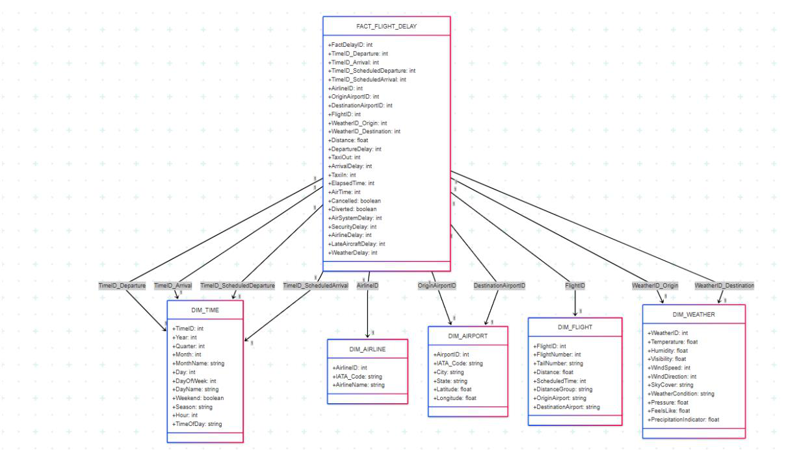
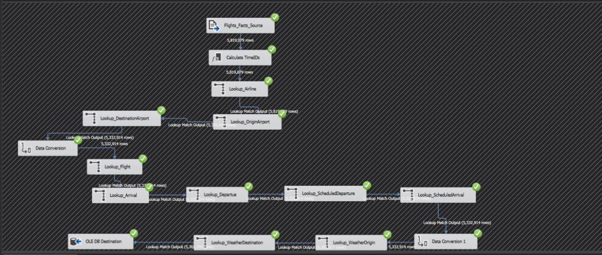
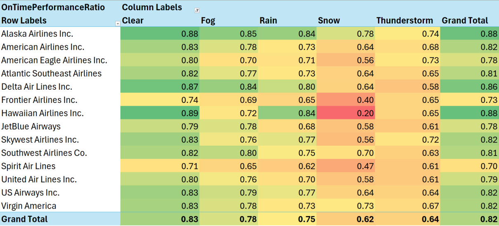
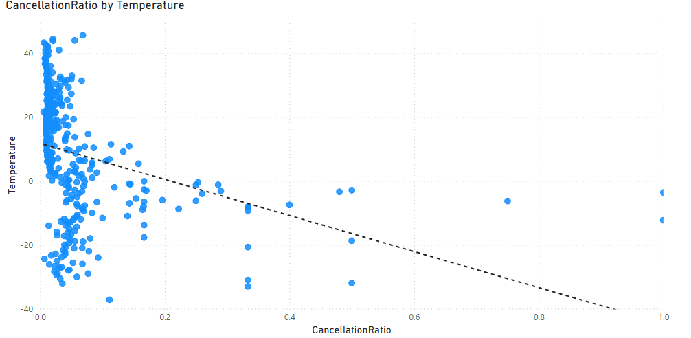
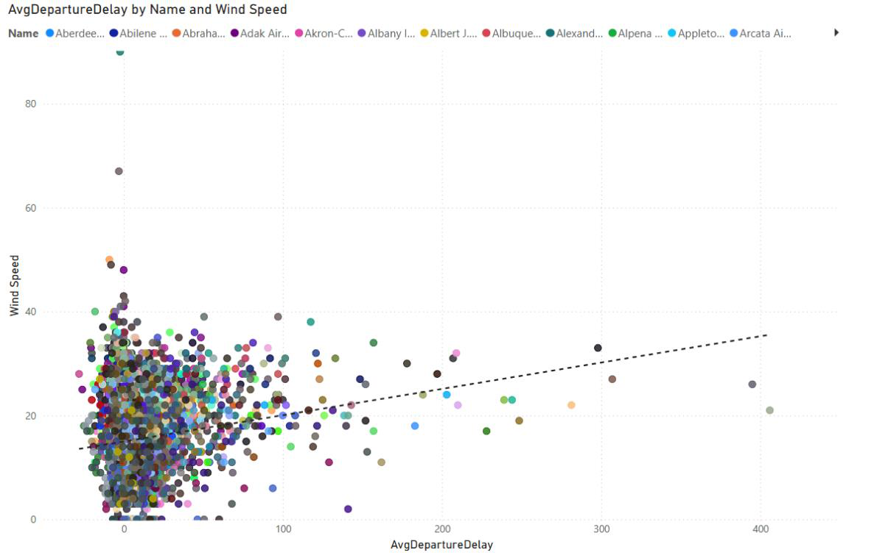
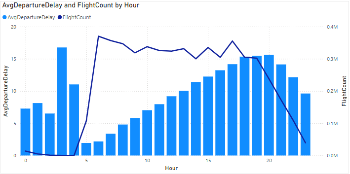
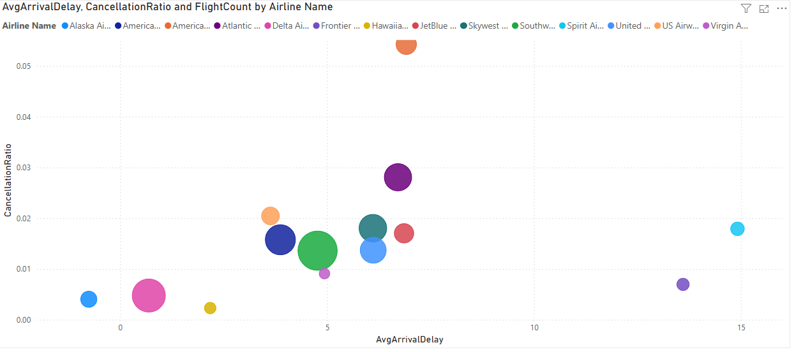
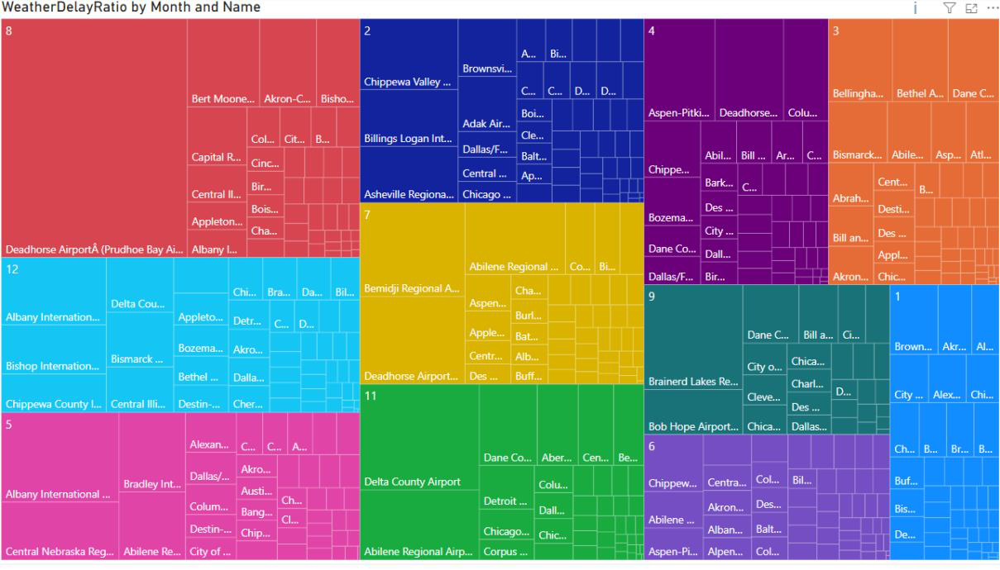

# US Flight Delays — Data Warehouse & OLAP Analysis

A university project (Data Warehouses course, 2025) analyzing flight delays and
cancellations in the US — the project that came before mini-Prescience. Same domain
(flight delays, weather, airports), opposite approach: this one is a classic
**descriptive** data warehouse and OLAP cube (SQL Server, SSIS, SSAS) answering
"what happened," where mini-Prescience is a **live predictive** model answering "what's
about to happen, and why."

## Dataset

- **flights.csv** — 5,819,079 US domestic flights, full year 2015
- **airlines.csv** / **airports.csv** — 14 carriers, 322 airports
- **weather_data2015_combined.csv** — 3,814,871 hourly weather observations from the
  [Iowa Environmental Mesonet](https://mesonet.agron.iastate.edu/) — the same weather
  archive mini-Prescience's `scripts/fetch_metar.py` pulls from, just a US/2015 slice
  instead of Europe/live

## Star schema

One fact table, five dimensions — a standard star schema, not a snowflake, so an
analyst can query it without chasing joins:



`FACT_FLIGHT_DELAY` carries both raw delay minutes (departure/arrival/taxi) **and** the
delay broken down by cause — air system, security, airline, late-aircraft, weather —
which the original CSV already provided per flight. mini-Prescience's `delayed_15min`
target is a single binary label; this schema kept the full cause breakdown, which is
genuinely richer for root-cause analysis than what the live project currently has.

## ETL

Built as SSIS packages, one job per dimension plus the fact table load (shown here:
loading `FACT_FLIGHT_DELAY`, joining airline/airport/flight/time/weather lookups
against 5.3M rows):



Error handling: every ETL run gets a unique batch ID (`20250526_0222_...`), and every
row loaded in that run is tagged with it. On failure, the package logs what broke to an
`ETL_LOG` table and deletes only rows from *its own* batch — data from previous
successful runs is never touched. Simple, but it's the right shape for an idempotent,
re-runnable load.

## OLAP cube & KPIs

Built in SSAS on top of the star schema, with calculated measures
(`OnTimePerformanceRatio`, `DelayRecoveryRatio`, `WeatherDelayRatio`, ...) and three
KPIs with status/trend expressions, e.g.:

```
OnTimePerformanceQuality:
  status: >= 0.90 -> good, >= 0.85 -> warning, else critical
  trend:  compares current month's ratio against the previous month
```

## Findings

Eleven multidimensional breakdowns were built against the cube; a few of the more
concrete ones:

**On-time performance collapses in bad weather, unevenly across carriers.**
Alaska and Delta hold up best in snow (0.78 / 0.64 ratio); Hawaiian's ratio in snow
(0.20) is the single worst cell in the whole matrix — but Hawaiian is *also* the best
performer in clear weather (0.89), so the airline isn't simply "bad," it's specifically
fragile to one condition its route network (inter-island Hawaii) rarely needs to plan
for.



**Temperature has a real, visible threshold around 0°C.** Below freezing, cancellation
ratio climbs sharply and gets noisy (some months see 30-40%+ cancellation rates in
severe cold); above roughly 10°C it stays under ~3% almost everywhere.



**Wind speed correlates with departure delay, but weakly and mostly at the extremes.**
Most delay happens under 20 knots regardless of delay length; the handful of
40+ minute delays cluster at higher wind speeds, but the relationship is a lot noisier
than temperature's.



**Delay is a daytime problem, not a weather-only one.** Average departure delay tracks
flight volume almost exactly through the day — climbing from a ~2-minute low before
5am to a ~15-16 minute peak in the early evening, then dropping again overnight. Fewer
flights early in the day means less queuing for the same runway/gate/ATC capacity.



**Cancellation and delay don't move together across carriers.** Plotting
`AvgArrivalDelay` against `CancellationRatio` per airline shows no clean correlation —
some carriers (Hawaiian, Alaska) are low on both, but others trade one for the other
(a carrier can run late a lot while rarely cancelling, or the reverse).



**Weather-caused delay is geographically concentrated**, not evenly spread across the
322 airports — a small cluster of airports account for a disproportionate share of
weather-delay minutes nationally.



## Where this led

Building the cube surfaced the obvious next question: all of this is retrospective —
useful for *"what should we have staffed for last January,"* useless for *"is EDDM
heading for trouble in the next two hours."* mini-Prescience is that same question
asked live: a trained model instead of a cube, a real-time feed instead of a 2015 CSV
dump, and a generated explanation instead of a pivot table someone has to read.

This page is a translated, condensed summary of the parts relevant to mini-Prescience's
own story. The original files (Polish) are in [`original/`](original/):
[`ProjektHurtownieCałe.pdf`](original/ProjektHurtownieCałe.pdf) (the full report this
page is drawn from), [`TworzenieTabelHurtownie.sql`](original/TworzenieTabelHurtownie.sql)
(the star-schema DDL), and the two presentation decks
([`PrezentacjaHurtownieDanych.pdf`](original/PrezentacjaHurtownieDanych.pdf),
[`PrezentacjaHurtownieDanych2.pdf`](original/PrezentacjaHurtownieDanych2.pdf)).
